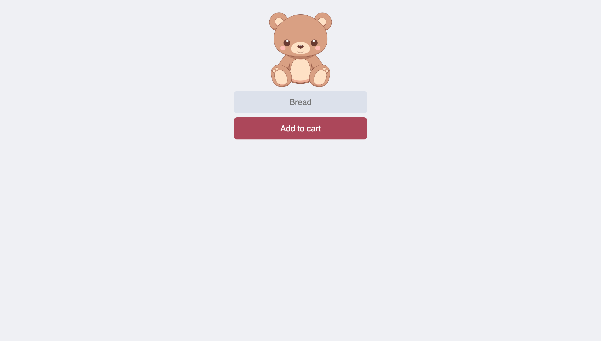

# Shopping List App

This project is part of the Scrimba course that teaches you how to build a mobile app using JavaScript, HTML, and CSS. The app allows users to add items to a shopping list, which is stored in a Firebase database.

## Visual Design

Below is a visual representation of the website page:



## Getting Started

To run this project locally, follow these steps:

1. **Clone the repository:**

```bash
git clone https://github.com/BhoomiGohil/Scrimba-JavaScriptCourseShoppingList.git
```

2. **Navigate to the project directory:**

```bash
cd Scrimba-JavaScriptCourseShoppingList
```

3. **Open the `index.html` file in your web browser.**

```bash
open index.html
```

OR

3. **Open the project using Live Server:**

If you're using Visual Studio Code, install the Live Server extension.
Click on the "Go Live" option to run the project.

**Note:** This project requires a Firebase Database to store and retrieve data. Please set up a Firebase project and update the `databaseURL` in the JavaScript code accordingly.

## Technologies Used

- HTML
- CSS
- JavaScript
- Firebase

## Features

- Add items to a shopping list.
- Remove items from the shopping list.
- Real-time updates using Firebase.

## Resources

Feel free to explore the code. Happy coding!
